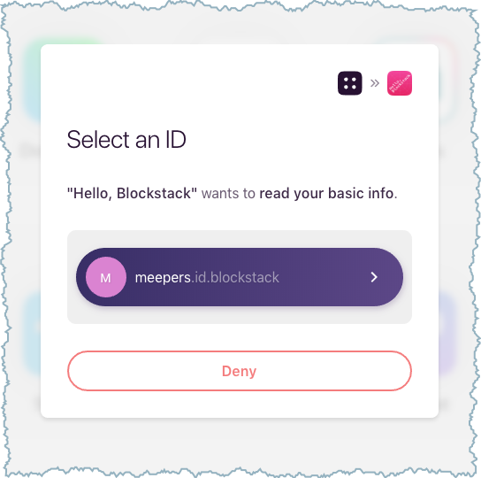
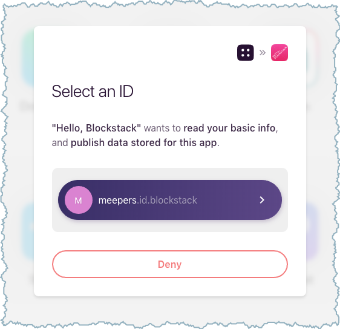
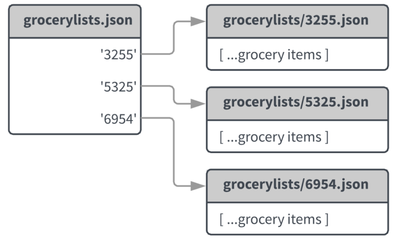
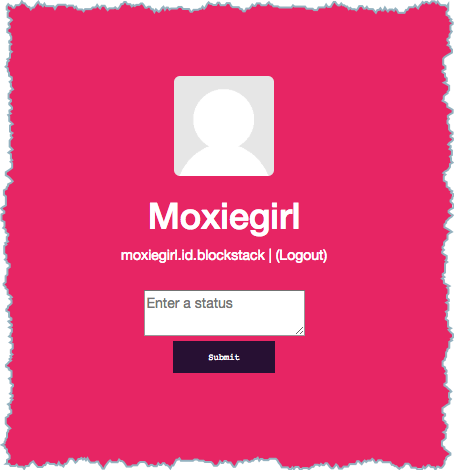
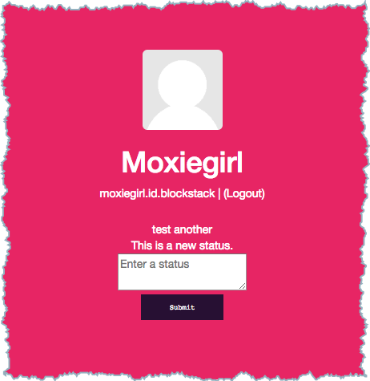
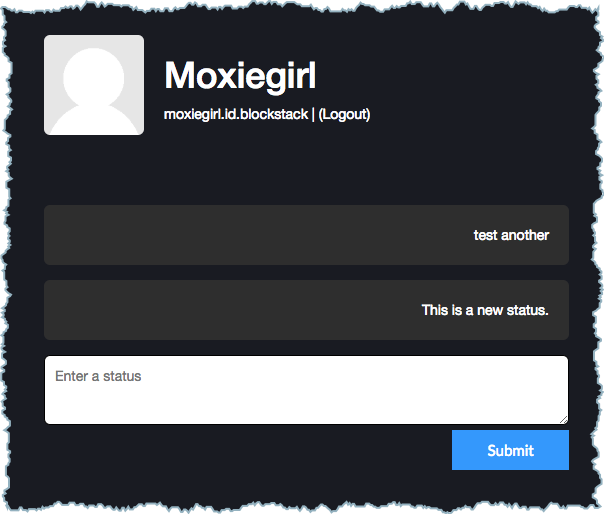

# Blockstack Storage Tutorial
{:.no_toc}

In this tutorial, you build a micro-blogging application using multi-player Gaia
storage. Gaia is Blockstack's [decentralized high-performance storage
system](https://github.com/blockstack/gaia). The tutorial contains the following
topics:

* TOC
{:toc}

This tutorial does not teach you about authentication. That is covered in depth [in the hello-blockstack tutorial](hello-blockstack).

<!--TODO: authentication tutorial-->
<!--Strictly speaking not sure it is necessary here to send them out-->



## About this tutorial and the prerequisites you need

The storage application you build with this tutorial is a React.js application
that is completely decentralized and server-less.  While not strictly required
to follow along, basic familiarity with React.js is helpful.

When complete, the app is capable of the following:

- authenticating users using Blockstack
- posting new statuses
- displaying statuses in the user profile
- looking up the profiles and statuses of other users

The basic identity and storage services are provided by `blockstack.js`. To test
the application, you need to have already [registered a Blockstack ID](ids-introduction).

The tutorial relies on the `npm` dependency manager. Before you begin, verify
you have installed `npm` using the `which` command.

```bash
$ which npm
/usr/local/bin/npm
```

If you don't find `npm` in your system, [install
it](https://www.npmjs.com/get-npm). Finally, if you get stuck at any point
while working on the tutorial, the completed [source code is available for
you](https://github.com/yknl/publik) to check your work against. You can also 
try out the [live build](https://publik.test-blockstack.com) of the app.

## Use npm to install Yeoman and the Blockstack App Generator

You use `npm` to install Yeoman. Yeoman is a generic scaffolding system that
helps users rapidly start new projects and streamline the maintenance of
existing projects.


1. Install Yeoman.

    ```bash
    npm install -g yo
    ```
2. Install the Blockstack application generator.

    ```bash
    npm install -g generator-blockstack
    ```

<!-- Need to find out if user is required to have React installed before running Yeoman. Doesn't appear to be the case. -->

## Generate and launch the public application

In this section, you build an initial React.js application called Publik.

1. Create a the `publik` directory.

    ```bash
    mkdir publik
    ```

2. Change into your new directory.

    ```bash
    cd publik
    ```

3. Use Yeoman and the Blockstack application generator to create your initial `publik` application.

    ```bash
    yo blockstack:react
    ```

    You should see several interactive prompts.

    ```bash
    $ yo blockstack:react
    ? ==========================================================================
    We're constantly looking for ways to make yo better!
    May we anonymously report usage statistics to improve the tool over time?
    More info: https://github.com/yeoman/insight & http://yeoman.io
    ========================================================================== No

         _-----_     ╭──────────────────────────╮
        |       |    │      Welcome to the      │
        |--(o)--|    │      Blockstack app      │
       `---------´   │        generator!        │
        ( _´U`_ )    ╰──────────────────────────╯
        /___A___\   /
         |  ~  |
       __'.___.'__
     ´   `  |° ´ Y `

    ? Are you ready to build a Blockstack app in React? (Y/n)
    ```

4. Respond to the prompts to populate the initial app.

    After the process completes successfully, you see a prompt similar to the following:

    ```bash
    [fsevents] Success:
    "/Users/theuser/repos/publik/node_modules/fsevents/lib/binding/Release/node-v59-darwin-x64/fse.node"
    is installed via remote npm notice created a lockfile as package-lock.json.
    You should commit this file. added 1060 packages in 26.901s
    ```

5. Run the initial application.

    ```bash
    npm start
    ```

    The system may prompt you to accept incoming connections.

    

6. If it does, choose **Allow**.

7. Your browswer –– Chrome by default –– will open to `http://127.0.0.1:3000/`.

   You should see a simple React app.

	 

8. Choose **Sign In with Blockstack**.

    The application tells you it will **Read your basic info**.

    

Leave your new application running and move onto the next section.

## Add the `publish_data` scope to sign in requests

Every app that uses Gaia storage must add itself to the user's `profile.json`
file. The Blockstack Browser does this automatically when the `publish_data`
scope is requested during authentication. For this application, the user files
stored on Gaia are made visible to others via the `apps` property in the user's
`profile.json` file.

Modify your authentication request to include the `publish_data` scope.

1. Open `src/components/App.js` file.

2. Locate the `AppConfig` declaration near the beginning of the file.

    ```javascript
    const appConfig = new AppConfig()
    ```

3. Change it to this:

    ```javascript
    const appConfig = new AppConfig(['store_write', 'publish_data'])
    ```

    By default, authentication requests include the `store_write` scope which
    enables storage. This is what allows you to store information to Gaia. Adding
    the `publish_data` scope allows your app to share data between users.

4. Save your changes.
5. Go back to your app at `http://127.0.0.1:3000/`.
6. Log out and sign in again.

    The authentication request now prompts the user for permission to **Publish
    data stored for the app**.

     

## Understand Gaia storage methods

Once you authenticate a user with `store_write` and `publish_data`, you can
begin to manage data for your users. Blockstack JS provides two methods within
the `UserSession` class, `UserSession.getFile` and `UserSession.putFile` for 
interacting with Gaia storage. The storage methods support all file types. 
This means you can store markdown, JSON, or even a custom format.

You can create a meaningful and complex data layer using these two methods.
Before creating an application, consider fundamental data architecture and make
some decisions about how you’re modeling data. For example, consider building a
simple grocery list app. A user should be able to create, read, update, and
delete grocery lists.

A single file collection stores items as an array nested inside each grocery
list:

```js
// grocerylists.json
{
  "3255": {
    "items": [
      "1 Head of Lettuce",
      "Haralson apples"
    ]
  },
  // ...more lists with items
}
```

This is conceptually the simplest way to manage grocery lists. When you read a
`/grocerylists.json` file with `getFile()`, you get back one or more grocery
lists and their items. When you write a single list, the `putFile()` method
overwrites the entire list. So, a write operation for a new or updated grocery
list must submit all existings lists as well.

Further, because this runs on the client where anything can go wrong. If the
client-side code encounters a parsing error with a user-input value and you
could overwrite the entire file with:

`line 6: Parsing Error: Unexpected token.`

Further, a single file makes pagination impossible and if your app stores a
single file for all list you have less control over file permissions. To avoid
these issues, you can create an index file that stores an array of IDs. These
IDs point to a name of another file in a `grocerylists` folder.



This design allows you to get only the files you need and avoid accidentally
overwriting all lists. Further, you’re only updating the index file when you add
or remove a grocery list; updating a list has no impact.


## Add support for user status submission and lookup

In this step, you add three `blockstack.js` methods that support posting of "statuses". 
These are the `UserSession.putFile`, `UserSession.getFile`, and `lookupProfile` methods.

1. Open the `src/components/Profile.js` file.

2. Replace the initial state in the `constructor()` method so that it holds the key properties required by the app.

    This code constructs a Blockstack `Person` object to hold the profile. Your constructor should look like this:

    ```javascript
    constructor(props) {
      super(props);

      this.state = {
        person: {
          name() {
            return 'Anonymous';
          },
          avatarUrl() {
            return avatarFallbackImage;
          },
        },
        username: "",
        newStatus: "",
        statuses: [],
        statusIndex: 0,
        isLoading: false
      };
    }
    ```


3. Locate the `render()` method.
4. Modify the `render()` method to add a text input and submit button to the 
   by replacing it with the code below:

    The following code renders the `person.name` and `person.avatarURL`
    properties from the profile on the display:

    ```javascript
    render() {
      const { handleSignOut, userSession } = this.props;
      const { person } = this.state;
      const { username } = this.state;

      return (
        !userSession.isSignInPending() && person ?
        <div className="container">
          <div className="row">
            <div className="col-md-offset-3 col-md-6">
              <div className="col-md-12">
                <div className="avatar-section">
                  
                  <div className="username">
                    <h1>
                      <span id="heading-name">{ person.name() ? person.name()
                        : 'Nameless Person' }</span>
                      </h1>
                    <span>{username}</span>
                    <span>
                      &nbsp;|&nbsp;
                      <a onClick={ handleSignOut.bind(this) }>(Logout)</a>
                    </span>
                  </div>
                </div>
              </div>

              <div className="new-status">
                <div className="col-md-12">
                  <textarea className="input-status"
                    value={this.state.newStatus}
                    onChange={e => this.handleNewStatusChange(e)}
                    placeholder="Enter a status"
                  />
                </div>
                <div className="col-md-12">
                  <button
                    className="btn btn-primary btn-lg"
                    onClick={e => this.handleNewStatusSubmit(e)}
                  >
                    Submit
                  </button>
                </div>
              </div>

            </div>
          </div>
        </div> : null
      );
    }
    ```

   This code allows the application to post statuses. It also displays the
   user's Blockstack ID. To display this, your app must extract the ID from the
   user profile data.

   Notice that the `userSession` property passed into our profile renderer contains
   the `isSignInPending()` method which checks if a sign in operation is pending.

5. Locate the `componentWillMount()` method.
6. Add the `username` property below the `person` property.

	 You'll use the Blockstack `loadUserData()` method in our user session to access the `username`.


    ```javascript
    componentWillMount() {
      const { userSession } = this.props
      this.setState({
        person: new Person(userSession.loadUserData().profile),
        username: userSession.loadUserData().username
      });
    }
    ```

7. Add two methods in the `Profile` class to handle the status input events:

    ```javascript
    handleNewStatusChange(event) {
      this.setState({newStatus: event.target.value})
    }

    handleNewStatusSubmit(event) {
      this.saveNewStatus(this.state.newStatus)
      this.setState({
        newStatus: ""
      })
    }
    ```

8. Add a `saveNewStatus()` method to save the new statuses.

    ```javascript
    saveNewStatus(statusText) {
      const { userSession } = this.props
      let statuses = this.state.statuses

      let status = {
        id: this.state.statusIndex++,
        text: statusText.trim(),
        created_at: Date.now()
      }

      statuses.unshift(status)
      const options = { encrypt: false }
      userSession.putFile('statuses.json', JSON.stringify(statuses), options)
        .then(() => {
          this.setState({
            statuses: statuses
          })
        })
    }
    ```

9. Save the `Profile.js` file.

   After the application compiles successfully, your application should appears as follows:

   

10. Enter your status in the text box and press the **Submit** button.

    At this point, the status you've just submitted isn't being displayed. 
    In the next section you add code to display the statuses back to the user as a blog entry.

## Fetch and display statuses

Update `Profile.js` again.

1. Go back to the `render()` method.
2. Locate the `<div className="new-status">` containing the text input and **Submit** button.
3. Right before the matching closing `</div>` element in this section, add this block.

    ```javascript
    <div className="col-md-12 statuses">
      {this.state.isLoading && <span>Loading...</span>}
      {this.state.statuses.map((status) => (
          <div className="status" key={status.id}>
            {status.text}
          </div>
        )
      )}
    </div>
    ```
   This displays existing state. Your code needs to fetch statuses on page load.

4. Add a new method called `fetchData()` after the `saveNewStatus()` method.

    ```javascript
    fetchData() {
      const { userSession } = this.props
      this.setState({ isLoading: true })
      const options = { decrypt: false }
      userSession.getFile('statuses.json', options)
        .then((file) => {
          var statuses = JSON.parse(file || '[]')
          this.setState({
            person: new Person(userSession.loadUserData().profile),
            username: userSession.loadUserData().username,
            statusIndex: statuses.length,
            statuses: statuses,
          })
        })
        .finally(() => {
          this.setState({ isLoading: false })
        })
    }
    ```

5. Call `fetchData()` from the `componentDidMount()` method. 

    ```javascript

    componentDidMount() {
      this.fetchData()
    }
    ```

6. Save the file.

    After the application compiles successfully, users are able to **Submit**
    multiple statuses and review them in the app.

    

## Change the style

1. Edit the `src/styles/style.css` file.
2. Replace the content with the following:


    ```css
    /* Globals */
    a,a:focus,a:hover{color:#fff;}
    html,body{height:100%;text-align:center;background-color:#191b22;}
    body{color:#fff}
    .hide{display:none;}
    .landing-heading{font-family:'Lato',Sans-Serif;font-weight:400;}

    /* Buttons */
    .btn{font-family:'Lato',Sans-Serif;padding:0.5625rem 2.5rem;font-size:0.8125rem;font-weight:400;line-height:1.75rem;border-radius:0!important;-webkit-transition:all .2s ease-in-out;-moz-transition:all .2s ease-in-out;-ms-transition:all .2s ease-in-out;-o-transition:all .2s ease-in-out;transition:all .2s ease-in-out;-webkit-user-select:none;-moz-user-select:none;-ms-user-select:none;user-select:none;}
    .btn-lg{font-size:1.5rem;padding:0.6875rem 3.4375rem;line-height:2.5rem;}
    .btn:focus,.btn:active:focus,.btn.active:focus{outline:none;}
    .btn-primary{color:#fff;border:1px solid #2C96FF;background-color:#2C96FF;}
    .btn-primary:hover,.btn-primary:focus,.btn-primary:active{color:#fff;border:1px solid #1a6ec0;background-color:#1a6ec0;}

    /* Avatar */
    .avatar{width:100px;height:100px;}
    .avatar-section{margin-bottom:25px;display:flex;text-align:left;}
    .username{margin-left:20px;}

    /* Scaffolding */
    .site-wrapper{display:table;width:100%;height:100vh;min-height:100%;}
    .site-wrapper-inner{display:flex;flex-direction:column;justify-content:center;margin-right:auto;margin-left:auto;width:100%;height:100vh;}
    .panel-authed{padding:0 0 0 0;}

    /* Home button */
    .btn-home-hello{position:absolute;font-family:'Source Code Pro',monospace;font-size:11px;font-weight:400;color:rgba(255,255,255,0.85);top:15px;left:15px;padding:3px 20px;background-color:rgba(255,255,255,0.15);border-radius:6px;-webkit-box-shadow:0px 0px 20px 0px rgba(0,0,0,0.15);-moz-box-shadow:0px 0px 20px 0px rgba(0,0,0,0.15);box-shadow:0px 0px 20px 0px rgba(0,0,0,0.15);}

    /* Input */
    input, textarea{color:#000;padding:10px;}
    .input-status{width:100%;height:70px;border-radius:6px;}
    .new-status{text-align:right;}

    /* Statuses */
    .statuses{padding-top:30px;}
    .status{margin:15px 0px;padding:20px;background-color:#2e2e2e;border-radius:6px}
    ```

3. Save and close the `src/styles/style.css` file.

    After the application compiles, you should see the following:

    


At this point, you have a basic micro-blogging app that users can use to post and
view statuses. However, there's no way to view other users' statuses. You'll add
that in the next section.

## Lookup user profiles

Let's now modify the `Profile.js` file to display profiles of other users. You'll
be using the `lookupProfile()` method that you added to the `import` statement
earlier. `lookupProfile()` takes a single parameter that is the Blockstack ID of
the profile and returns a profile object.

### Add a new route

Make some changes to the routing structure of your app so that users can view
other users' profiles by visiting `http://127.0.0.1:3000/other_user.id`


1. Edit the  `src/components/App.js` file.
2. Add the new route by importing the `Switch` and `Route` components from `react-router-dom`:

    ```javascript
    import { Switch, Route } from 'react-router-dom'
    ```
3. Locate this line below in the `render()` method:

    ```javascript
    : <Profile userSession={userSession} handleSignOut={ this.handleSignOut } />
    ```

4. Replace it with the following:

    ```javascript
      :
      <Switch>
        <Route
          path='/:username?'
          render={
            routeProps => 
              <Profile 
                userSession={userSession} 
                handleSignOut={ this.handleSignOut } 
                {...routeProps} 
              />
          }
        />
      </Switch>
    ```

    This sets up a route and captures the route path in the URL as the profile lookup username.

5. Save and close the the `src/components/App.js` file.


### Add in lookupProfile

You also need to add a rule to your app's webpack config so that you can properly
process URL paths that contain the `.` (dot) character for example,
`http://localhost:8080/other_user.id`

**NOTE**: In a production app, you must ensure the web server is configured to handle this.


1. Open the `src/components/Profile.js` file.

2. Expand the `import from blockstack` statement to include the `lookupProfile` method.
    
    Add `lookupProfile` after `Person`.

		When you are done, the import statement should look like the following:

    ```javascript
    import {
      Person,
      lookupProfile
    } from 'blockstack';
    ```

3. Add a single method to the `Profile` class that determines if the app is viewing the local user's profile or another user's profile.

    ```javascript
    isLocal() {
      return this.props.match.params.username ? false : true
    }
    ```

    You use `isLocal()` to check if the user is viewing the local user profile or another user's profile. If it's the local user profile, the app runs the `getFile()` function you added in an earlier step. Otherwise, the app looks up the profile belonging to the `username` using the `lookupProfile()` method.

4. Modify the `fetchData()` method like so:

    ```javascript
    fetchData() {
      const { userSession } = this.props
      this.setState({ isLoading: true })
      if (this.isLocal()) {
        const options = { decrypt: false }
        userSession.getFile('statuses.json', options)
          .then((file) => {
            var statuses = JSON.parse(file || '[]')
            this.setState({
              person: new Person(userSession.loadUserData().profile),
              username: userSession.loadUserData().username,
              statusIndex: statuses.length,
              statuses: statuses,
            })
          })
          .finally(() => {
            this.setState({ isLoading: false })
          })
      } else {
        const username = this.props.match.params.username

        lookupProfile(username)
          .then((profile) => {
            this.setState({
              person: new Person(profile),
              username: username
            })
          })
          .catch((error) => {
            console.log('could not resolve profile')
          })
      }
    }
    ```

     **NOTE**: For `https` deployments, the default Blockstack Core API endpoint for name
     lookups should be changed to point to a core API served over `https`.
     Otherwise, name lookups fail due to browsers blocking mixed content.
     Refer to the [Blockstack.js
     documentation](http://blockstack.github.io/blockstack.js/#getfile) for
     details.

5. Add the following block to `fetchData()` right after the call to `lookupProfile(username)... catch((error)=>{..}` block:

    ```javascript
    const options = { username: username, decrypt: false }
    userSession.getFile('statuses.json', options)
      .then((file) => {
        var statuses = JSON.parse(file || '[]')
        this.setState({
          statusIndex: statuses.length,
          statuses: statuses
        })
      })
      .catch((error) => {
        console.log('could not fetch statuses')
      })
      .finally(() => {
        this.setState({ isLoading: false })
      })
    ```

    This fetches the user statuses.

    Finally, you must conditionally render the logout button, status input textbox, and submit button so they don't show up when viewing another user's profile.

6. Replace the `render()` method with the following:

    ```javascript
    render() {
    const { handleSignOut, userSession } = this.props;
    const { person } = this.state;
    const { username } = this.state;

    return (
      !userSession.isSignInPending() && person ?
      <div className="container">
        <div className="row">
          <div className="col-md-offset-3 col-md-6">
            <div className="col-md-12">
              <div className="avatar-section">
                
                <div className="username">
                  <h1>
                    <span id="heading-name">{ person.name() ? person.name()
                      : 'Nameless Person' }</span>
                  </h1>
                  <span>{username}</span>
                  {this.isLocal() &&
                    <span>
                      &nbsp;|&nbsp;
                      <a onClick={ handleSignOut.bind(this) }>(Logout)</a>
                    </span>
                  }
                </div>
              </div>
            </div>
            {this.isLocal() &&
              <div className="new-status">
                <div className="col-md-12">
                  <textarea className="input-status"
                    value={this.state.newStatus}
                    onChange={e => this.handleNewStatusChange(e)}
                    placeholder="What's on your mind?"
                  />
                </div>
                <div className="col-md-12 text-right">
                  <button
                    className="btn btn-primary btn-lg"
                    onClick={e => this.handleNewStatusSubmit(e)}
                  >
                    Submit
                  </button>
                </div>
              </div>
            }
            <div className="col-md-12 statuses">
            {this.state.isLoading && <span>Loading...</span>}
            {this.state.statuses.map((status) => (
                <div className="status" key={status.id}>
                  {status.text}
                </div>
                )
            )}
            </div>
          </div>
        </div>
      </div> : null
    );
    }
    ```

    This checks to ensure that users are viewing their own profile, by wrapping the **Logout** button and inputs with the `{isLocal() && ...}` condition.

### Put it all together

1. Stop the running application in terminal by sending a CTRL-C.
2. Restart the application so that the disabling of the `.` (dot) rule takes effect.

    ```bash
    npm start
    ```

3. Point your browser to `http://127.0.01:3000/your_username.id.blockstack` to see the final application. 

## Wrapping up

Congratulations, you are all done! We hope you've enjoyed learning a bit more
about Blockstack. 

A few things to note, you'll notice that in our `putFile()` and `getFile()` calls, we chose not to encrypt/decrypt because our app is meant to share statuses publicly. By default, `putFile()` and `getFile()` will encrypt all data stored, making it unreadable by everyone except the logged in user.

## Resources

[Complete source code](https://github.com/yknl/publik)

[Live demo](https://publik.test-blockstack.com)
