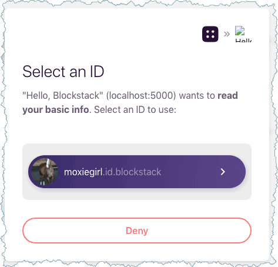
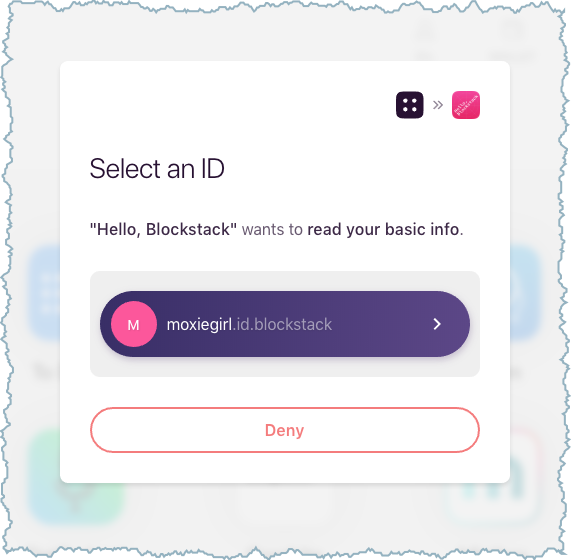

# Hello, Blockstack Tutorial

In this tutorial, you generate a simple application on Blockstack. The application
is a single-page application (SPA) that runs completely client-side. The
application has no backend API to talk to, other than the identity and storage
API that the user provides. In this sense, the application is a completely
decentralized, server-less application. You work through the following sections:

* TOC
{:toc}



## About this tutorial and the prerequisites you need

For this tutorial, we will use the following tools:

- `npm` to manage dependencies and scripts
- `browserify` to compile node code into browser-ready code
- `blockstack.js` to authenticate the user and work with the user's identity/profile information

The application you build is a React.js application that is completely
decentralized and server-less.  While not strictly required to follow along,
basic familiarity with React.js is helpful.

When complete, the app is capable of the following:

- authenticating users using Blockstack
- posting new statuses
- displaying statuses in the user profile
- looking up the profiles and statuses of other users

The basic identity and storage services are provided by `blockstack.js`. To test
the application, you need to have already registered a Blockstack ID.

The tutorial relies on the `npm` dependency manager. Before you begin, verify
you have installed `npm` using the `which` command to verify.

```bash
$ which npm
/usr/local/bin/npm
```

If you don't find `npm` in your system, [install
it](https://www.npmjs.com/get-npm).

Finally, make sure you have [created at least one Blockstack ID]({{ site.baseurl }}/browser/ids-introduction.html#create-an-initial-blockstack-id). You'll use this ID to interact with the application.

## Use npm to install Yeoman and the Blockstack App Generator

You use `npm` to install Yeoman. Yeoman is a generic scaffolding system that
helps users rapidly start new projects and streamline the maintenance of
existing projects.


1. Install Yeoman.

    ```bash
    npm install -g yo
    ```
2. Install the Blockstack application generator.

    ```bash
    npm install -g generator-blockstack
    ```

## Generate an initial Blockstack application

In this section, you build an initial React.js application called `hello-world-tutorial`.

1. Create the `hello-world-tutorial` directory.

    ```bash
    mkdir hello-world-tutorial
    ```

2. Change into your new directory.

    ```bash
    cd hello-world-tutorial
    ```

3. Use Yeoman and the Blockstack application generator to create your initial `hello-world-tutorial` application.

    ```bash
    yo blockstack
    ```

    You should see several interactive prompts.

    ```bash
    $ yo blockstack

         _-----_     ╭──────────────────────────╮
        |       |    │      Welcome to the      │
        |--(o)--|    │      Blockstack app      │
       `---------´   │        generator!        │
        ( _´U`_ )    ╰──────────────────────────╯
        /___A___\   /
         |  ~  |
       __'.___.'__
     ´   `  |° ´ Y `

    ? Are you ready to build a Blockstack app? (Y/n)
    ```

4. Respond to the prompts to populate the initial app.

    After the process completes successfully, you see a prompt similar to the following:

    ```bash
    ...
   create public/icon-192x192.png
   create public/index.html
   create public/robots.txt
   create public/manifest.json


    I'm all done. Running npm install for you to install the required dependencies. If this fails, try running the command yourself.
    ```

Depending on your environment you may have some problems with the `npm` packages. Go ahead and fix these before continuing to the next section.

## Review the basic application structure

The initial application you create is a generic Javascript application you run
with a local express node. Before you continue, take a moment to examine the
structure of this generic application structure:

| File             | Description                       |
|------------------|-----------------------------------|
| .editorconfig    | Sets universal values for editor. |
| .gitignore       | Git configuration file.           |
| firebase.json    | Configuration for mobile application.|
| package.json     | Specifies required packages.       |
| requires.js      | A Javascript module loader.        |
| server.js        | Simple static server configuration.|

In the `public` folder you find these files:

| File             | Description                       |
|------------------|-----------------------------------|
| app.css   | Contains application styles.             |
| app.js    | Main application file.                   |
| bootstrap.min.css | Minified css for production.     |
| favicon.ico      | Website icon.
| icon-192x192.png | Application icon.                  |
| index.html       | Single page.                      |
| manifest.json    | Tells the browser about the application and how it should behave.|
| robots.txt       | Configures crawling and indexing. |

The simple static file server in the `server.js` file serves all of the files in
the `/public` directory, including `index.html`, `app.js`, `bootstrap.min.css`
and `app.css`. The main file of the application is in the `app.js`. It contains
the majority of the application logic.

## Start the server and view the application

When you start the server, it will create a Node.js server, start it locally,
and open your browser 'http://localhost:5000'.  From the root of your new application directory:

1. Start the application server.

    ```bash
    npm start
    ```

    The first time you run it, your system prompts you to accept incoming connections.

    

2. Choose **Allow**.

3. Open your browser to `http://localhost:5000`.

   You should see a simple application:

   

4. Choose **Sign In with Blockstack**.

    The application detects whether the user has the Blockstack client edition installed or
    not. This is done automatically by the Blockstack API, more about this later.
    What the browser displays depends on the users' current state.

    | Using web app    | Has client edition installed      |
    |------------------|-----------------------------------|
    |  |  |

    If the user logged into the Blockstack Browser but not reset it, the user can
    simply use the exiting identity.

   

   If the user chooses **Deny**, the Blockstack Browser displays its
   **Home** page but the user is not logged into the sample application.

5. Leave your new application running and move onto the next section.

## Understand the generated application code

In this section, you look at the basic application generated with the `yo
blockstack` command. The generated code contains simple authentication methods
that allow a user to log into the browser. The main application code is located
in the `public/app.js` file. Open this file now.

All of the code in the file is wrapped in an event
listener.

```js
document.addEventListener("DOMContentLoaded", event => {
})
```

This listener that waits until the DOM content is loaded. Then, it creates an auth request and redirects the user to sign in:

```js
document.getElementById('signin-button').addEventListener('click', event => {
  event.preventDefault()
  userSession.redirectToSignIn()
})
```

You can find the `redirectToSignIn()` function is part of the [Blockstack Javascript documentation](https://blockstack.github.io/blockstack.js/). There is also a sign out button handler. This handler deletes the local user data and signs the user out:

```js
document.getElementById('signout-button').addEventListener('click', event => {
  event.preventDefault()
  userSession.signUserOut()
  window.location = window.location.origin
})
```

The handlers are followed by a `showProfile()` function for showing the user's profile:

```js
function showProfile(profile) {
  let person = new blockstack.Person(profile)
  document.getElementById('heading-name').innerHTML = person.name() ? person.name() : "Nameless Person"
  if(person.avatarUrl()) {
    document.getElementById('avatar-image').setAttribute('src', person.avatarUrl())
  }
  document.getElementById('section-1').style.display = 'none'
  document.getElementById('section-2').style.display = 'block'
}
```

Each `getElementById()` function refers to elements in the `index.html` file.

Once a user is successfully signed in, there is logic for loading the user
profile and displaying the application. As illustrated earlier, there are
several states the user can be in:

- The user is already signed in
- The user has a pending sign in request
- The user is signed out

The application handles these situations as followed:

```js
const appConfig = new blockstack.AppConfig()
const userSession = new blockstack.UserSession({ appConfig: appConfig })

if (userSession.isUserSignedIn()) {
  const { profile } = userSession.loadUserData()
  showProfile(profile)
} else if (userSession.isSignInPending()) {
  userSession.handlePendingSignIn().then(userData => {
    window.location = window.location.origin
  })
}
```

When the user is signed in, Blockstack loads the user data from local storage
and displays the profile with the `showProfile()` function. When the user has a
pending sign in request, the application signs the user in and redirects the
user back to the home page.

### Application manifest

The  application's `/public/manifest.json` file configures your app. The
configurations dictate how the application is displayed in auth views and on
user home screens. The contents are very simple:

```json
{
  "name": "Hello, Blockstack",
  "start_url": "localhost:5000",
  "description": "A simple demo of Blockstack Auth",
  "icons": [{
    "src": "https://helloblockstack.com/icon-192x192.png",
    "sizes": "192x192",
    "type": "image/png"
  }]
}
```

Keep it as is or fill it in with new information that describes your app.

### Save your application code

Complete the tutorial by storing your app code on GitHub. Before you begin, make sure you have a GitHub account and have configured your environment to use it.

1. Initialize the application code as a Git repo.

    ```bash
    git init
    ```

2. Add and commit all of the files:

    ```bash
    git add . && git commit -m "first commit"
    ```

3. In GitHub, create a `hello-blockstack` repository.

4. Back in your terminal window, add a remote for GitHub.

    Make sure to fill in your username:

    ```bash
    git remote add origin git@github.com:YOUR_USERNAME_HERE/hello-blockstack.git
    ```

5. Push your new code to the master branch of the remote repo:

    ```
    git push origin master
    ```

You're done! You just built your first Blockstack app and shipped the code.
You're well on your way to becoming a Blockstack app legend.
