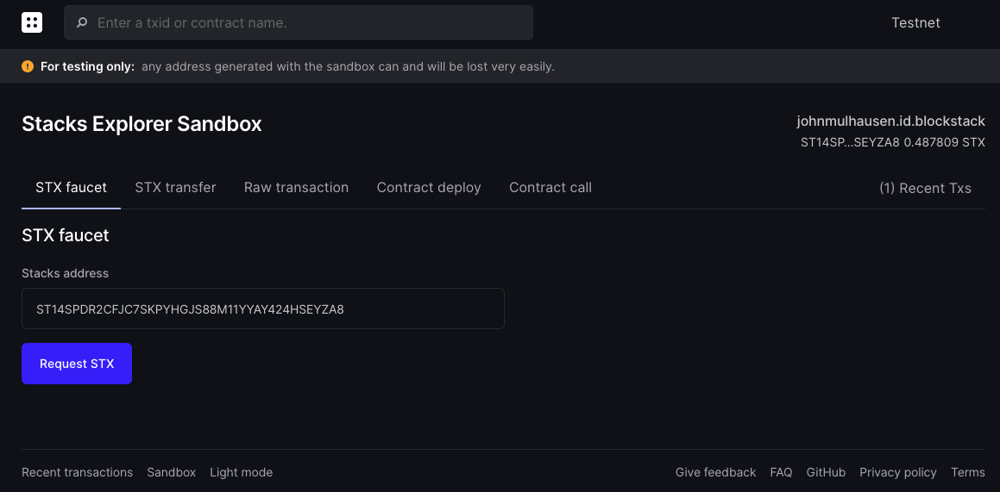
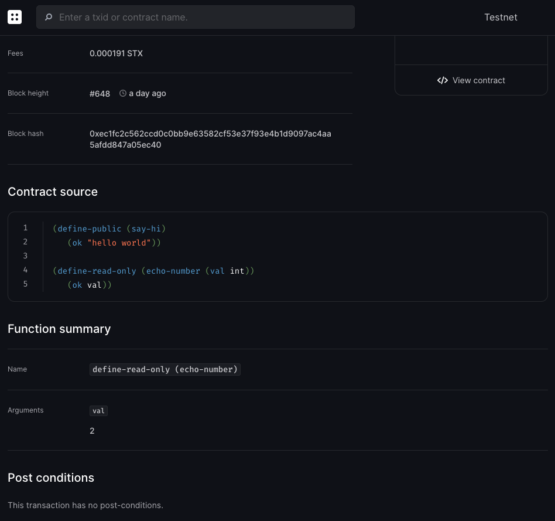

# Hello, World!

## Overview

| Experience | | **Beginner**  |
| Duration | | **18 minutes** |

In the world of smart contracts, everything is a blockchain transaction. You use tokens in your wallet to deploy a smart contract in a transaction, and each call to that contract after it's published is a transaction, too. That means that at each step, tokens are being exchanged as transaction fees. This tutorial introduces you to this mode of programming, which transforms blockchains into powerful state machines capable of executing complex logic.

Clarity, Blockstack's smart contracting language, is based on LISP and uses its parenthesized notation. Clarity is an [interpreted language](https://en.wikipedia.org/wiki/Interpreted_language), and [decidable](https://en.wikipedia.org/wiki/Recursive_language). To learn more basics about the language, see the [Introduction to Clarity](overview.html) topic.

By the end of this tutorial, you will:

* Have a working Clarity starter project and local dev environment
* Understand basic Clarity language design principles
* Deploy a contract to the Stacks 2.0 blockchain and call its public methods
* Understand how to use the Explorer Sandbox functionality


## Prerequisites

### Set up your Node environment

You will need [NodeJS](https://nodejs.org/en/download/) `8.12.0` or higher to complete this tutorial. You can verify your installation by opening up your terminal and run the following command:

```shell
node --version
```

### Install Visual Studio Code with Clarity Extensions

[Visual Studio Code](https://code.visualstudio.com/) (aka VS Code) is a free development interface for which Blockstack has created custom extensions, to make it easier to create smart contracts with Clarity.

[Install Visual Studio Code](https://code.visualstudio.com/download) and be sure to install the following extensions for the best coding experience:

- [Clarity](https://marketplace.visualstudio.com/items?itemName=blockstack.clarity), the official language extension by Blockstack that defines the Clarity language for VS Code and provides auto-complete and syntax highlighting.
- [clarity-lsp](https://marketplace.visualstudio.com/items?itemName=lgalabru.clarity-lsp), which adds inline help functionality for Clarity to VS Code
- [Rainbow Brackets](https://marketplace.visualstudio.com/items?itemName=2gua.rainbow-brackets), which adds helpful colorization of matching pairs of parentheses while you code

> **Note**: If you need help installing extensions, review [Extension Marketplace](https://code.visualstudio.com/docs/editor/extension-gallery) in the Visual Studio Code docs.

## Download a starter project

Using your terminal, run the following command to create a new folder and initialize a new project:

```bash
mkdir hello-world; cd hello-world
npm init clarity-starter
```

After the starter project is loaded up, you have to select a project template. Select `hello-world`, which is the default, by hitting ENTER.

```bash
? Template - one of [hello-world, counter]: (hello-world)
```

## Review the contract

Select **File** > **Add Folder to Workspace** in VS Code, and add the `hello-world` folder you created in the previous step. Then, navigate to `contracts/hello-world.clar`.

You will see that the program and each statement is enclosed in `()` (parentheses), and the smart contract consists of two functions.

```cl
(define-public (say-hi)
  (ok "hello world"))

(define-read-only (echo-number (val int))
  (ok val))
```

On the first line, a new public function `say-hi` is declared. Public functions are callable from other smart contracts, enabling developers to break complex tasks into smaller, simpler smart contracts (an exercise in [separating concerns](https://en.wikipedia.org/wiki/Separation_of_concerns)).



The function doesn't take any parameters and simply returns "hello world" using the [`ok`](clarityRef.html#ok) response constructor.

The second function, `echo-number`, is a [read-only function](clarityRef.html#define-read-only). Read-only functions are also public, but as the name implies, they can not perform any datamap modifications. `echo-number` takes an input parameter of the type [`int`](clarityRef.html#int-type). Along with integer, Clarity supports the following types:
* [uint](clarityRef.html#uint-type): 16-byte unsigned integer
* [principal](clarityRef.html#principal-type): spending entity, roughly equivalent to a Stacks address
* [boolean](clarityRef.html#bool-type): `true` or `false`
* [buffer](clarityRef.html#buffer-type): fixed-length byte buffers
* [tuple](clarityRef.html#tuple-type): named fields in keys and values

`echo-number` uses an [`ok`](clarityRef.html#ok) response to return the value passed to the function.

## Access the Explorer Sandbox

{% include note.html content="<p>This tutorial uses a developer preview release of the <a href='https://testnet-explorer.blockstack.org/'>Stacks 2.0 Explorer</a>. Please feel free to report issues or request enhancements on the <a href='https://github.com/blockstack/explorer/issues/new'>blockstack/explorer</a> repository. For more details about this release, see the <a href='https://forum.blockstack.org/t/explore-the-stacks-2-0-testnet-with-the-new-explorer-developer-preview/10889'>Explore the Stacks 2.0 Testnet</a> post in the Blockstack forums.</p><p>If you encounter trouble using the Explorer Sandbox, try falling back to <a href='#get-familiar-with-cli-optional'>the CLI instructions at the end of this page</a>.</p>" %}

Open up the [Stacks 2.0 Explorer Sandbox view](https://testnet-explorer.blockstack.org/sandbox). The Explorer Sandbox is a web-enabled view of the Testnet blockchain, and has tools for validating contracts, testing out transactions, and generating Testnet STX tokens. Here, we will run the code from `hello-world` right in the browser and create blockchain transactions right in the browser.

You will be asked to sign in with or sign up for a Blockstack ID, which creates a new STX address for you on the Testnet blockchain, where you can receive tokens. Follow the steps on the screen to complete the process.



Once completed, you will see the Sandbox screen and a confirmation, indicating you were provided with a new STX address for testing purposes.

## Obtain STX tokens

Uploading and calling smart contracts requires fees to be paid to the network to process the transactions. The Testnet Explorer features the capability to request STX tokens that can be used to pay the fees ("STX faucet").

On the [**STX faucet**](https://testnet-explorer.blockstack.org/sandbox?tab=faucet) screen, your new STX address will be prefilled. Click **Request STX** to receive 0.5 STX at your address.

A confirmation for a new transaction will pop up. If you want to see the details of your faucet request, you can click **View transaction**. However, you will to refresh the page a few times, for up to a minute or so, while the transaction completes.


## Deploy the contract

Go back to the Sandbox screen, switch to the [**Contract deploy**](https://testnet-explorer.blockstack.org/sandbox?tab=contract-deploy) tab, and do the following:

1. Enter a name for the contract under **Contract name** that uses lower-case letters, dashes, and numbers only.
2. Replace code in the text area under **Contract source code** with the contents of `contracts/hello-world.clar`.
3. Ignore the **Choose from sample** drop-down for now. After completing this tutorial you can come back to the Explorer Sandbox and use this drop-down to try other sample contracts.
3. Click **Deploy contract**.


A confirmation will pop up, indicating that a new contract deploy transaction was issued. As with the faucet request, you can click **View transaction** to review the pending transaction if you like, but you'll need to keep refreshing the page until the deploy transaction completes. Once you're able to see the completed deploy transaction, you will see that every smart contract's source code is publicly verifiable through the explorer.

## Call the public method

Go back to the Sandbox screen, switch to the [**Contract call**](https://testnet-explorer.blockstack.org/sandbox?tab=contract-call) tab, and enter the following details:

* **Contract address**: Your generated STX address. Hover over the identity component on the right side of the screen to copy your full address and paste it in here.
* **Contract name**: Whatever you entered as your contract name in the previous step. If you forgot, you can review your recent transactions by following the link on the upper-right, and look up your contract creation transaction.


After clicking **Search**, you will see the two public methods implemented in the smart contract.

Locate the `(echo-number)` method, provide any integer for the `val` argument and click **Submit**. You will see the value you entered echoed back at you on the screen, as well as a confirmation that a contract call transaction was issued. Click on the transaction to review it. In the next seconds, your contract call should be completed and you will see a contract call success screen. Scroll down to the function summary section to verify your contract call:



**Congratulations! You just deployed your smart contract and called a public function on the Testnet.**

---

With the completion of this tutorial, you now:

* Have a working Clarity starter project and local dev environment
* Understand basic Clarity language design principles
* Have deployed a contract to the Stacks 2.0 blockchain and called its public methods
* Understand how to use the Explorer Sandbox functionality

## Get familiar with CLI (optional)

The steps above provide an easy way to get started with contract deployment and contract calls. If you want to stay in the terminal and get access to more advanced capabilities, you should use the Blockstack CLI.

The following set of commands will achieve the same goals as the above workflow.

Install an early release of the new Blockstack CLI for Stacks 2.0.

```shell
sudo npm install -g "https://github.com/blockstack/cli-blockstack#feature/stacks-2.0-tx"
```

Create a new STX address and save keychain details, using the `-t` flag to target Testnet.

```shell
blockstack make_keychain -t > new_keychain.txt
```

See your new STX address.

```shell
cat new_keychain.txt
```

Call the Testnet faucet to get STX tokens; replace `<stx_address>` with the address you obtained in the previous step.

```shell
curl -XPOST "https://sidecar.staging.blockstack.xyz/sidecar/v1/debug/faucet?address=<stx_address>" | json_pp
```

Confirm faucet transaction.

```shell
blockstack balance <stx_address> -t
```

Deploy a contract file to Testnet.

```shell
blockstack deploy_contract ./hello-world.clar hello-world 2000 0 <stx_private_key> -t
```

Call the `echo-number` method of the contract.

```shell
blockstack call_contract_func <stx_address> hello-world echo-number 2000 1 <stx_private_key> -t
```

To learn more about the Blockstack CLI commands, you can run `blockstack-cli help all`.

## Where to go next

{:.no_toc}


* <a href="tutorial-counter.html">Next tutorial: Writing a counter smart contract</a>
* <a href="tutorial-test.html">Tutorial: Testing contracts with JavaScript and Mocha</a>
