# iOS DApps
{:.no_toc}

This tutorial teaches you how to create a decentralized application using
Blockstack's iOS SDK using the following content:

* TOC
{:toc}

This tutorial was extensively tested using Xcode Version 11.2 (11B52) on a MacBook Pro
running Mojave 10.14. If your environment is different, you may encounter
slight or even major discrepancies when performing the procedures in this
tutorial. Please [join the Blockstack community Slack](https://slofile.com/slack/blockstack) and post questions or comments to
the `#support` channel.

Finally, this tutorial is written for all levels from the beginner to the most
experienced. For best results, beginners should follow the guide as written. It
is expected that the fast or furiously brilliant will skip ahead and improvise
on this material at will. God speed one and all.

If you want to download a complete application rather than working through a tutorial, see this *alternative* sample, the <a href="https://github.com/blockstack/photoblock-demo" target="_blank">photoblock-demo</a>.

## Understand the sample application flow

When complete, the sample application is a simple `hello-world` intended for use
on an iOS phone.

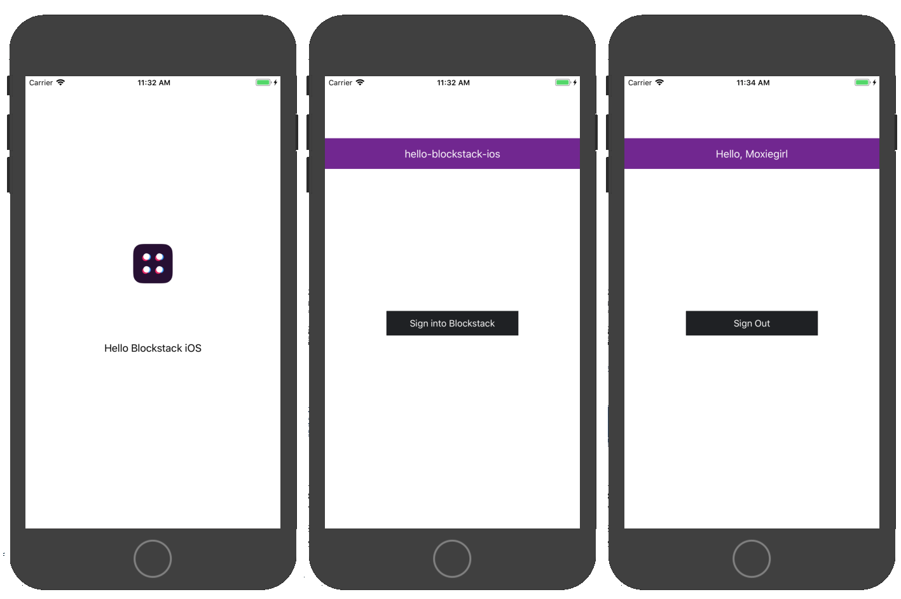

Only users with an existing `blockstack.id` can run your
final sample application. When complete, users interact with the sample
application by doing the following:


## Set up your environment

This sample application requires two code bases, a BlockStack `hello-blockstack` web
application and a `hello-ios` iOS application. You use the iOS application to run the
web application on an iOS device.

Before you start developing the sample, there are a few elements you need in
your environment.

### Install XCode

If you are an experienced iOS developer and already have an iOS
development environment on your workstation, you can use that and skip this
step. However, you may need to adjust the remaining instructions for your
environment.

Follow the installation instructions to [download and install XCode](https://developer.apple.com/xcode/) for your operating system.
Depending on your network connection, this can take between 15-30 minutes.

### Do you have Node.js?

Node.js v10 or higher is recommended the minimum supported version is Node.js v8. Before you begin, verify you have the correct version of Node.js and its tools installed.

```bash
$ node -v
v12.10.0
$ which npm npx
/usr/local/bin/npm
/usr/local/bin/npx
```

If you don't have these installed, take a moment to install or upgrade as needed.

### Install the CocoaPods 1.6.0 dependency manager

The sample application only runs on devices with iOS 11.0 or higher. You install
the Blockstack iOS SDK through the CocoaPods. Cocoapods is a dependency manager
for Swift and Objective-C Cocoa projects. It’s a simple, user friendly way to
use libraries from the community in your project.

You must use CocoaPods version `1.6.0` or newer to avoid an
incompatibility between Cocoapods and XCode. Before starting the tutorial, confirm
you have installed CocoaPods.

```bash
$ pod --version
1.8.1
```

If you don't have the CocoaPods beta version, install it:

```bash
sudo gem install cocoapods -v 1.8.1
```

## Build the Blockstack hello-world

In this section, you build a Blockstack `hello-world` application. Then, you
modify the `hello-world` to interact with the iOS app via a redirect.

### Generate and launch your hello-blockstack application



In this section, you build an initial React.js application called
`hello-blockstack`.

1. Create a `hello-blockstack` directory.

    ```bash
    mkdir hello-blockstack
    ```

2. Change into your new directory.

    ```bash
    cd hello-blockstack
    ```

3. Create your initial `hello-world-tutorial` application.

    ```bash
    $ npx generator-blockstack --react
      npx: installed 338 in 13.792s
        create package.json
        create .gitignore
        create webpack.config.js
        create netlify.toml
        create firebase.json
        ...
        I'm all done. Running npm install for you to install the required dependencies. If this fails, try running the command yourself.

      > fsevents@1.2.9 install /private/tmp/testymc/node_modules/fsevents
      > node install
      added 775 packages from 455 contributors and audited 9435 packages in 20.934s
      found 0 vulnerabilities

     ```

    Depending on your environment you may have some warnings with the installation. Optionally, you can fix these before continuing to the next section.

4. Run the initial application.

    ```bash
     npm run start

    > hello-blockstack@0.0.0 start /Users/meepers/repos/hello-blockstack
    > webpack-dev-server

    Project is running at http://localhost:8080/
    webpack output is served from /
    404s will fallback to /index.html
    Hash: 4d2312ba236a4b95dc3a
    Version: webpack 2.7.0
    Time: 2969ms
                                     Asset       Size  Chunks                    Chunk Names
    ....
      Child html-webpack-plugin for "index.html":
         chunk    {0} index.html 541 kB [entry] [rendered]
             [0] ./~/lodash/lodash.js 540 kB {0} [built]
             [1] ./~/html-webpack-plugin/lib/loader.js!./src/index.html 533 bytes {0} [built]
             [2] (webpack)/buildin/global.js 509 bytes {0} [built]
             [3] (webpack)/buildin/module.js 517 bytes {0} [built]
     webpack: Compiled successfully.
     ```

   At this point, the browser is running a Blockstack server on your local host.

5. Navigate to `http://localhost:8080` with your browser to display the
   application.

   

   This local instances is for testing your applications only.

6. Choose **Sign in with Blockstack**

   The system displays a prompt allowing you to create a new Blockstack ID or restore an existing one.

    

7. Follow the prompts appropriate to your situation.

    If you are restoring an existing ID, you may see a prompt about your user
    being nameless, ignore it. At this point you have only a single application
    on your test server.  So, you should see this single application, with your
    own `blockstack.id` display name, once you are signed in:
    
    


### Add a redirect end point to your application

When a user opens the webapp from the Blockstack Browser on an iOS phone,
you want the web app to redirect the user to your iOS application. The work
you do here will allow it.

1. From the terminal command line, change directory to your web
application directory (`hello-blockstack`).

1. If it doesn't ext, create the `public` directory.

    ```bash
    $ mkdir public
    ```

2. Use the `touch` command to add a redirect endpoint to your application.

   This endpoint on the web version of your app will redirect iOS users back
   to your mobile app.

    ```bash
    $ touch public/redirect.html
    ```

3. Open `redirect.html` and add code to the endpoint.

    ```
    <!DOCTYPE html>
    <html>
    <head>
      <title>Hello, Blockstack!</title>
      <script>
      function getParameterByName(name) {
        var match = RegExp('[?&]' + name + '=([^&]*)').exec(window.location.search);
        return match && decodeURIComponent(match[1].replace(/\+/g, ' '));
      }

      var authResponse = getParameterByName('authResponse')
      window.location="myblockstackapp://?authResponse=" + authResponse
      </script>
    <body>
    </body>
    </html>
    ```

    Blockstack apps are identified by their domain names.  The endpoint will
    receive a get request with the query parameter `authResponse=XXXX` and
    should redirect the browser to `myblockstackapp:XXXX`.

    `myblockstackapp:` is custom protocol handler. The handler should be unique
    to your application. Your app's web-based authentication uses this handler
    to redirect the user back to your iOS app. Later, you'll add a reference
    to this handler in your iOS application.

4. Close and save the `redirect.html` file.
5. Ensure your Blockstack app compiles successfully.

   The `npm` process should detect and compile your change.

## Build the hello-blockstack-ios

Now, you build an iOS application that can work with your Blockstack web
application on a mobile device.

### Create an XCode Project

This tutorial uses XCode 11.1, you can use another version but be aware that some
menu items and therefore these procedures may be differœent on your version.

1. Launch the XCode interface.
2. Choose **Create a new XCode project**.
3. Select **iOS**.
4. Select **Single View App**.

   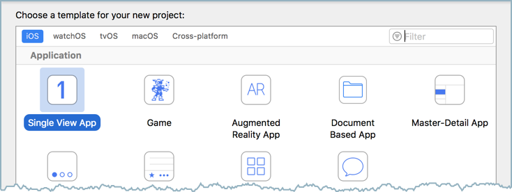

5. On the **Choose options for your new project** dialog, set the following:

    <table class="uk-table uk-table-small">
    <tr>
      <th>Product Name</th>
      <td><code>hello-blockstack-ios</code></td>
    </tr>
    <tr>
      <th>Organization Name</th>
      <td><code><i>USERNAME</i></code></td>
    </tr>
    <tr>
      <th>User Interface</th>
      <td>Storyboard</td>
    </tr>
    </table>

	 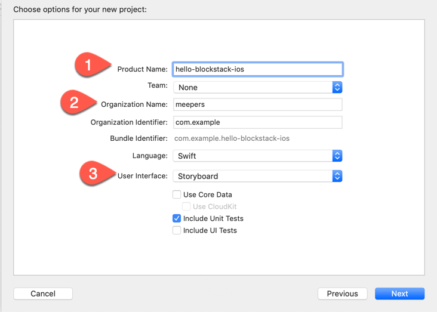

6. Press **Next**.

   The system prompts you for a location to store your code.

7. Save your project in your `hello-blockstack-ios` directory.

8. Close XCode.


### Add and edit a Podfile

To use CocoaPods you need to define the XCode target to link them to.
So, for exampleM if you are writing an iOS app, it would be the name of your app.
Create a target section by writing target `$TARGET_NAME do` and an `end` a few
lines after.

1. Open a terminal window on your workstation.
2. Change directory into your new project directory where your `hello-blockstack-ios.xcodeproj` file was created.

	 ```swift
	 $ cd hello-blockstack-ios
	 ```
3. Create a Podfile.

	 ```bash
	 $ pod init
	 ```

	 The command creates a `Podfile` in the directory.

4. Open the `Podfile` for editing.
5. Add a line stating the Blockstack dependency.

   ```
   # Uncomment the next line to define a global platform for your project
   # platform :ios, '9.0'

   target 'hello-blockstack-ios' do
		 # Comment the next line if you're not using Swift and don't want to use dynamic frameworks
		 use_frameworks!

		 # Pods for hello-blockstack-ios
		 pod 'Blockstack'

		 target 'hello-blockstack-iosTests' do
		   inherit! :search_paths
		   # Pods for testing
		 end
   end
   ```

8. Save and close the `Podfile`.

### Install Blockstack SDK and open the pod project

1. Close your new XCode project if you haven't already.
2. In terminal, make sure it is open to the root of your `hello-blockstack-ios` project.
3. Initialize the project with Cocoapods via the `pod install` command.

	 ```bash
	 $ pod install
     Analyzing dependencies
     Downloading dependencies
     Installing Blockstack (1.0.1)
     Installing CryptoSwift (0.15.0)
     Installing PromisesObjC (1.2.8)
     Installing PromisesSwift (1.2.8)
     Installing STRegex (2.1.0)
     Generating Pods project
     Integrating client project

	 [!] Please close any current XCode sessions and use `hello-blockstack-ios.xcworkspace` for this project from now on.
	 Sending stats
	 Pod installation complete! There is 1 dependency from the Podfile and 2 total pods installed.

	 [!] Automatically assigning platform `ios` with version `11.3` on target `hello-blockstack-ios` because no platform was specified. Please specify a platform for this target in your Podfile. See `https://guides.cocoapods.org/syntax/podfile.html#platform`.
	 ```

	This command creates a number of files

4. Review the files that the `pod` installation created:

   ```bash
   $ ls
   Podfile                hello-blockstack-ios                    hello-blockstack-iosTests
   Podfile.lock           hello-blockstack-ios.xcodeproj
   Pods                   hello-blockstack-ios.xcworkspace
   ```
5. Start XCode and choose **Open another project**.
6. Choose the `.xcworkspace` file created in your project folder.

	 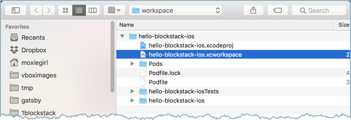

	 When you open the workspace, the system will begin indexing the project. Then, after indexing, you **may** see a warning indicator at the top in the
	 project title. If you see the warning, continue to step 7. Otherwise, go to the next section.

7. Click the signal to reveal the warning.
8. Click **Next**.

	 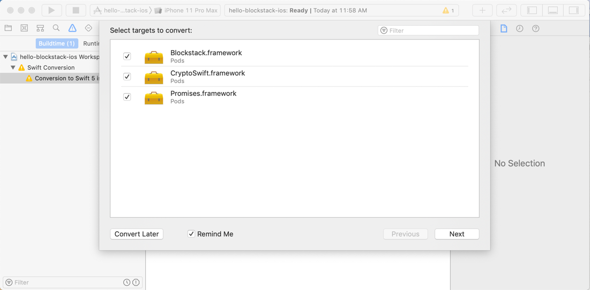

9. Select all the targets and press **Next** and **Continue** when prompted.

	 Make sure you have no errors; warnings are acceptable to continue.

### Choose a custom protocol handler

You'll need to choose a custom protocol handler that is unique to your app. This
is so that your app's web-based authentication `redirect.html` endpoint can redirect
the user back to your iOS app. In this example, you use `myblockstackapp://`.

1. Open the `.xcworkspace` file in XCode if it isn't open already.
2. Select the top node of your project.
3. Select the **Info** tab in XCode.
4. Scroll to **URL Types** and press **+** (plus) sign.
5. Enter an **Identifier** and **URL Schemes** value.

   | **Identifier** | `MyBlockstackApp` |
   | **URL Schemes** | `myblockstackapp` |

6. Set the **Role** to **Editor**.

   When you are done the **URL Types** appears as follows:

	 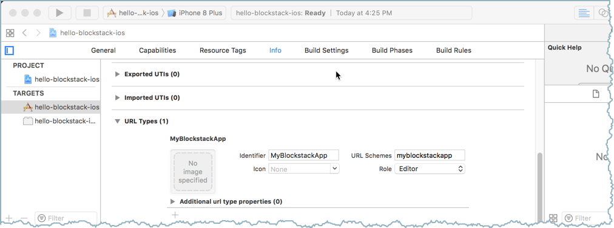

### Add a splash screen

All iOS applications require a splash page.

1. Select `Assets.xcassets`
2. Move your cursor into the area below Appicon.
3. Right click and choose **New Image Set**

   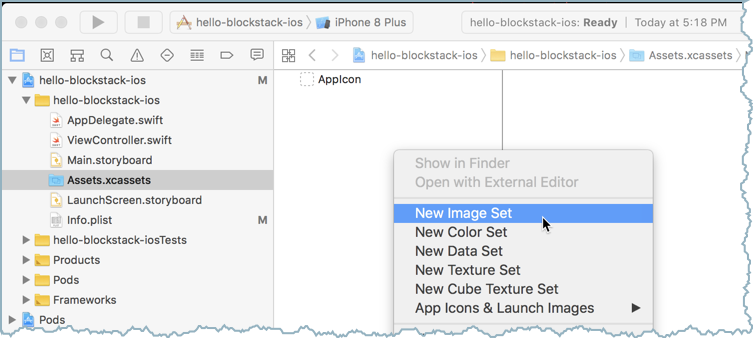

4. Download the Blockstack icon.

   

5. Drag the downloaded file into the **3X** position in your new Images folder.

    

6. Select the `LaunchScreen.storyboard`.
7. Choose **Open As > Source Code**.

	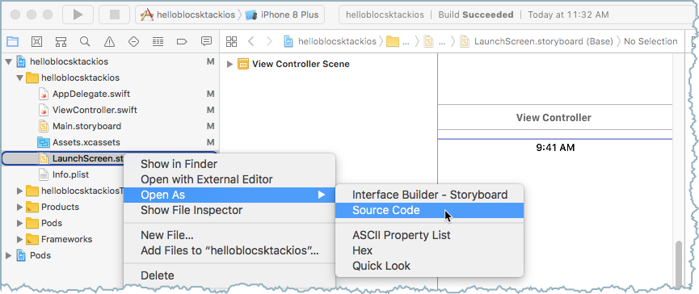

8. Replace the content of the `<scenes>` element with the following:

   ```
   <scenes>
       <!--View Controller-->
       <scene sceneID="EHf-IW-A2E">
           <objects>
               <viewController id="01J-lp-oVM" sceneMemberID="viewController">
                   <view key="view" contentMode="scaleToFill" id="Ze5-6b-2t3">
                       <rect key="frame" x="0.0" y="0.0" width="375" height="667"/>
                       <autoresizingMask key="autoresizingMask" widthSizable="YES" heightSizable="YES"/>
                       <subviews>
                           <imageView userInteractionEnabled="NO" contentMode="scaleToFill" horizontalHuggingPriority="251" verticalHuggingPriority="251" image="Image" translatesAutoresizingMaskIntoConstraints="NO" id="SpU-hA-y2f">
                               <rect key="frame" x="155.5" y="273" width="64" height="64"/>
                           </imageView>
                           <label opaque="NO" userInteractionEnabled="NO" contentMode="left" horizontalHuggingPriority="251" verticalHuggingPriority="251" text="Hello Blockstack iOS" textAlignment="natural" lineBreakMode="tailTruncation" baselineAdjustment="alignBaselines" adjustsFontSizeToFit="NO" translatesAutoresizingMaskIntoConstraints="NO" id="Wfj-A6-BZM">
                               <rect key="frame" x="108" y="432" width="158" height="21"/>
                               <fontDescription key="fontDescription" type="system" pointSize="17"/>
                               <nil key="textColor"/>
                               <nil key="highlightedColor"/>
                           </label>
                       </subviews>
                       <color key="backgroundColor" red="1" green="1" blue="1" alpha="1" colorSpace="custom" customColorSpace="sRGB"/>
                       <constraints>
                           <constraint firstItem="Wfj-A6-BZM" firstAttribute="centerX" secondItem="6Tk-OE-BBY" secondAttribute="centerX" id="AZy-qf-xHq"/>
                           <constraint firstItem="Wfj-A6-BZM" firstAttribute="top" secondItem="6Tk-OE-BBY" secondAttribute="top" constant="412" id="SwP-qV-1RP"/>
                           <constraint firstItem="SpU-hA-y2f" firstAttribute="centerX" secondItem="6Tk-OE-BBY" secondAttribute="centerX" id="XdI-Db-fDo"/>
                           <constraint firstItem="SpU-hA-y2f" firstAttribute="top" secondItem="6Tk-OE-BBY" secondAttribute="top" constant="253" id="xc5-po-W1E"/>
                       </constraints>
                       <viewLayoutGuide key="safeArea" id="6Tk-OE-BBY"/>
                   </view>
               </viewController>
               <placeholder placeholderIdentifier="IBFirstResponder" id="iYj-Kq-Ea1" userLabel="First Responder" sceneMemberID="firstResponder"/>
           </objects>
           <point key="canvasLocation" x="52" y="374.66266866566718"/>
       </scene>
   </scenes>
   ```

9. Immediately after scenes but before the close of the `</document>` tag add the following `<resources>`.

   ```xml
		   <resources>
         <image name="Image" width="64" height="64"/>
		   </resources>
		</document>
   ```

10. Choose **Run > Run app** in the emulator.

	  The emulator now contains a new splash screen.

	  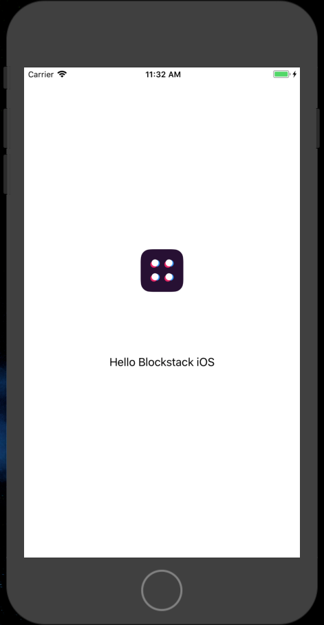


### Update the Main.storyboard

Rather than have you build up your own UI in the interface builder, this section has you copy and paste a layout into the XML file source code for the **Main.storyboard** file.

1.  Select the `Main.storyboard` file.
2.  Choose **Open As > Source Code**

    The `hello-blockstack-ios/Base.lproj/Main.storyboard` file
    defines the graphical elements, and their functionality will be defined in 
    a respective `.swift` file.

3. Within the `<viewController>`  element, replace the existing `<view>` sub-element with the following:

   ```xml
   <view key="view" contentMode="scaleToFill" id="8bC-Xf-vdC">
        <rect key="frame" x="0.0" y="0.0" width="375" height="667"/>
        <autoresizingMask key="autoresizingMask" widthSizable="YES" heightSizable="YES"/>
        <subviews>
            <label opaque="NO" userInteractionEnabled="NO" contentMode="left" horizontalHuggingPriority="251" verticalHuggingPriority="251" text="hello-blockstack-ios" textAlignment="center" lineBreakMode="tailTruncation" baselineAdjustment="alignBaselines" adjustsFontSizeToFit="NO" translatesAutoresizingMaskIntoConstraints="NO" id="9eE-ZS-LU9">
                <rect key="frame" x="0.0" y="101" width="375" height="50"/>
                <color key="backgroundColor" red="0.44735813140000003" green="0.1280144453" blue="0.57268613580000005" alpha="1" colorSpace="custom" customColorSpace="sRGB"/>
                <constraints>
                    <constraint firstAttribute="height" constant="50" id="U5v-13-4Ux"/>
                </constraints>
                <fontDescription key="fontDescription" type="system" pointSize="17"/>
                <color key="textColor" white="1" alpha="1" colorSpace="custom" customColorSpace="genericGamma22GrayColorSpace"/>
                <nil key="highlightedColor"/>
            </label>
            <button opaque="NO" contentMode="scaleToFill" contentHorizontalAlignment="center" contentVerticalAlignment="center" buttonType="roundedRect" lineBreakMode="middleTruncation" translatesAutoresizingMaskIntoConstraints="NO" id="Lfp-KX-BDb">
                <rect key="frame" x="100" y="382" width="175" height="40"/>
                <color key="backgroundColor" red="0.1215686275" green="0.12941176469999999" blue="0.14117647059999999" alpha="1" colorSpace="custom" customColorSpace="sRGB"/>
                <constraints>
                    <constraint firstAttribute="height" constant="40" id="8fN-Ro-Krn"/>
                </constraints>
                <color key="tintColor" white="0.0" alpha="1" colorSpace="calibratedWhite"/>
                <state key="normal" title="Sign into Blocksack">
                    <color key="titleColor" white="1" alpha="1" colorSpace="custom" customColorSpace="genericGamma22GrayColorSpace"/>
                </state>
                <connections>
                    <action selector="signIn:" destination="BYZ-38-t0r" eventType="touchUpInside" id="nV7-rt-euZ"/>
                </connections>
            </button>
        </subviews>
        <color key="backgroundColor" red="1" green="1" blue="1" alpha="1" colorSpace="custom" customColorSpace="sRGB"/>
        <constraints>
            <constraint firstItem="9eE-ZS-LU9" firstAttribute="leading" secondItem="6Tk-OE-BBY" secondAttribute="leading" id="2ZP-tU-h9Y"/>
            <constraint firstItem="9eE-ZS-LU9" firstAttribute="top" secondItem="6Tk-OE-BBY" secondAttribute="top" constant="81" id="DBh-q0-pAV"/>
            <constraint firstItem="6Tk-OE-BBY" firstAttribute="trailing" secondItem="Lfp-KX-BDb" secondAttribute="trailing" constant="100" id="MHO-ew-4Bd"/>
            <constraint firstItem="Lfp-KX-BDb" firstAttribute="leading" secondItem="6Tk-OE-BBY" secondAttribute="leading" constant="100" id="Rsm-LP-ya7"/>
            <constraint firstItem="Lfp-KX-BDb" firstAttribute="top" secondItem="6Tk-OE-BBY" secondAttribute="top" constant="362" id="chE-B7-ya6"/>
            <constraint firstItem="6Tk-OE-BBY" firstAttribute="trailing" secondItem="9eE-ZS-LU9" secondAttribute="trailing" id="j0x-8j-04u"/>
        </constraints>
        <viewLayoutGuide key="safeArea" id="6Tk-OE-BBY"/>
    </view>
	 ```
4. Select the Main.storyboard and choose **Open as  > Interface Builder - Storyboard**.

   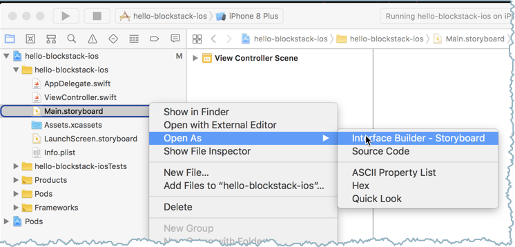

   You should see the following:

   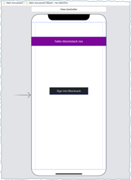


### Add the UI variables to the ViewController file.

In this section, you edit the `ViewController.swift` file using the storyboard as a starting point.

1. Select the **Main.storyboard** and choose **Open As > Interface Builder - storyboard**.

2. With the interface builder open, choose **Editor > Assistant** to edit the `ViewController.swift` file.

   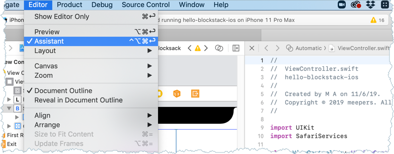

3. In the storyboard, select the **Sign into Blockstack** button.

4. Control-drag from the button to the code display in the editor on the right, stopping the drag at the line below controller's `viewDidLoad()` statement.

   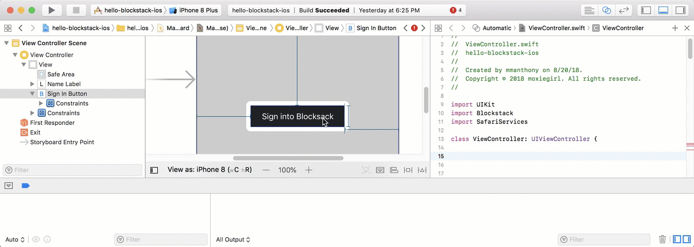

5. Set the **Connection** to `Outlet`.
6. Name the new section `signInButton`.

   

7. Press **Connect**.
8. Repeat with purple **hello-blockstack-ios** label, name it `nameLabel.

9. Add an import statement for the `Blockstack` and another for the `SafariServices` module.

    When you are done, your `ViewController.swift` file contains the following:

    ```swift
    import UIKit
    import Blockstack
    import SafariServices

    class ViewController: UIViewController {

        override func viewDidLoad() {
            super.viewDidLoad()
            // Do any additional setup after loading the view.
        }

            @IBOutlet weak var nameLabel: UILabel!
            @IBOutlet var signInButton: UIButton!

    }
    ```

    And XCode has added two outlines to the `Main.storyboard` source.

    ```xml
    <connections>
    <outlet property="nameLabel" destination="9eE-ZS-LU9" id="Ahv-Te-ZZo"/>
    <outlet property="signInButton" destination="Lfp-KX-BDb" id="yef-Jj-uPt"/>
    </connections>
    ```

    Your connectors will have their own `destination` and `id` values.


### Edit the ViewController.swift file

Now, you are ready to connect your application with your Blockstack Web
Application. Normally, after building your Web application you would have
registred it with Blockstack and the app would be available on the Web. This
example skips this registration step and uses an example application we've
already created for you:

`https://heuristic-brown-7a88f8.netlify.app/redirect.html`

This web application already has a redirect in place for you. You'll reference
this application in your mobile add for now. In XCode, do the following;


1. Open the `ViewController.swift` file.
2. Add an import both for `Blockstack`.

   ```
	 import UIKit
	 import Blockstack
	 ```

3. Add a private `updateUI()` function.

   This function takes care of loading the user data from Blockstack.

   ```swift
   private func updateUI() {
       DispatchQueue.main.async {
           if Blockstack.shared.isUserSignedIn() {
               // Read user profile data
               let retrievedUserData = Blockstack.shared.loadUserData()
               print(retrievedUserData?.profile?.name as Any)
               let name = retrievedUserData?.profile?.name ?? "Nameless Person"
               self.nameLabel?.text = "Hello, \(name)"
               self.nameLabel?.isHidden = false
               self.signInButton?.setTitle("Sign Out", for: .normal)
               print("UI update SIGNED_IN")
           } else {
               self.nameLabel?.text = "hello-blockstack-ios"
               self.signInButton?.setTitle("Sign into Blockstack", for: .normal)
               print("UI update SIGNED_OUT")
           }
       }
   }
    ```

   The function uses the `Blockstack.shared.isUserSignedIn()` method to determine if
   the user is already logged into Blockstack or not. It then uses the
   `Blockstack.shared.loadUserData()` method to load the user data and update
   the application display with the username.

5. Replace the content of the `viewDidLoad()` function so that it calls this private function.

   ```swift
   override func viewDidLoad() {
       super.viewDidLoad()
       // Do any additional setup after loading the view, typically from a nib.
       self.updateUI()
   }
	 ```

9. Create a `signIn()` function that handles both sign in and out.

   The function uses the `Blockstack.shared.signIn()` and
   `Blockstack.shared.signUserOut()` methods to sign the user into the application.

    ```swift
    @IBAction func signIn(_ sender: UIButton) {
       if Blockstack.shared.isUserSignedIn() {
           print("Currently signed in so signing out.")
           Blockstack.shared.signUserOut()
           self.updateUI()
       } else {
           print("Currently signed out so signing in.")
           // Address of deployed example web app
           Blockstack.shared.signIn(redirectURI: URL(string: "https://heuristic-brown-7a88f8.netlify.app/redirect.html")!,
                                    appDomain: URL(string: "https://heuristic-brown-7a88f8.netlify.app")!) { authResult in
                                       switch authResult {
                                       case .success(let userData):
                                           print("Sign in SUCCESS", userData.profile?.name as Any)
                                           self.updateUI()
                                       case .cancelled:
                                           print("Sign in CANCELLED")
                                       case .failed(let error):
                                           print("Sign in FAILED, error: ", error ?? "n/a")
                                       }
           }
       }

    }
    ```

## Troubleshooting your build in XCode

XCode builds can retain old data. To ensure your builds are clean, try the following:

1. Reset the simulator by choosing **Hardware -> Erase all content and settings** from the menu.
2. In XCode, clean the project by choosing **Product > Clean** from the menu or  press `Command + Shift + K` on your keyboard.
3. Clean the build folder by pressing `Command + Option + Shift + K` on your keyboard.
4. Run the code on the simulator again.
