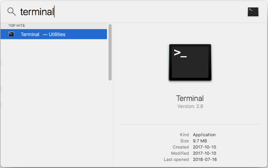
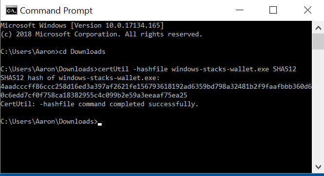

# Install the Stacks Wallet software

You use the Stacks Wallet software client alone or with a hardware wallet to send and receive Stacks (STX) tokens. On this page, you learn how to install the Stacks Wallet software. This page contains the following:

* TOC
{:toc}




## Mac Installation

1. <a href="https://wallet.blockstack.org" target="\_blank">Go to the wallet download page</a> in your browser.
2. Select the **MacOS Download** button.

   This button downloads the software to your computer.

3. Open a terminal window.

   To find the terminal software, enter `terminal` into the Spotlight search.

   

4. In the terminal window, enter the command to change directory to the folder where you downloaded the wallet software.

   The default location is the **Downloads** folder, type the following into the terminal and press RETURN on your keyboard.

   ```
   cd ~/Downloads
   ```

5. In the terminal window, type the following Command

    ```
    shasum -a 512 Stacks-Wallet-macOS-3.0.0.dmg
    ```

    

6. Verify that the resulting hash (a string of letters and numbers) is the same as the latest hash published <a href="https://github.com/blockstack/stacks-wallet/releases" target="\_blank">on this page</a>.


## Windows Installation

1. Select the **Windows Download** button <a href="https://wallet.blockstack.org/" target="\_blank">on this page</a>.

   This button downloads the software to your computer.

2. Open a command prompt.

   To find the command prompt software, enter `command` into the Start menu.

   

3. In the command prompt window, enter the command to change directory to the folder where you downloaded the wallet software.

   The default location is the **Downloads** folder, type the following at the command prompt and press RETURN on your keyboard.

   ```
   cd <You-User-Directory>/Downloads
   ```

4. In the command prompt window, type the following at the command prompt.

    ```
    certUtil -hashfile Stacks-Wallet-win10-3.0.0.exe SHA512
    ```

    

5. Verify that the resulting hash (a string of letters and numbers) is the same as the latest hash published <a href="https://github.com/blockstack/stacks-wallet/releases" target="\_blank">on this page</a>.

## Additional requirement and option

Sending and receiving Stacks (STX) does require a Bitcoin account. You also have the option to use the wallet with or without a hardware wallet.  

### Bitcoin account for fuel (required)

You need very small fractions of Bitcoin to fuel your Stacks Wallet transactions. For example, .00025 Bitcoin can fuel several transactions. You can acquire this Bitcoin fuel and send it to the Stacks Wallet via a Coinbase or other Bitcoin account. Before you begin using the wallet transactions, make sure that you have such an account. You must create this account yourself.

### Hardware wallet (optional but recommended)

If you have a paper wallet or a custodial wallet, you should set up a secondary hardware. You can then transfer small amounts to this hardware wallet for use with your Stacks Wallet. You can use any of these hardware wallets with the Stacks Wallet:

* <a href="https://trezor.io/" target="\_blank">Trezor</a> One
* <a href="https://www.ledger.com/" target="\_blank">Ledger</a> Nano S
* Ledger Blue hardware wallet.

For information on setting up a hardware wallet, refer to the vendor's
documentation. We cannot help you set up your hardware wallet.


