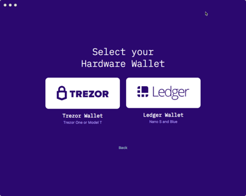
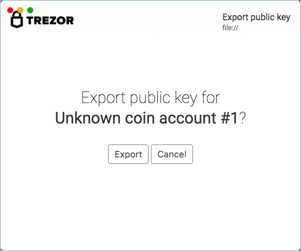
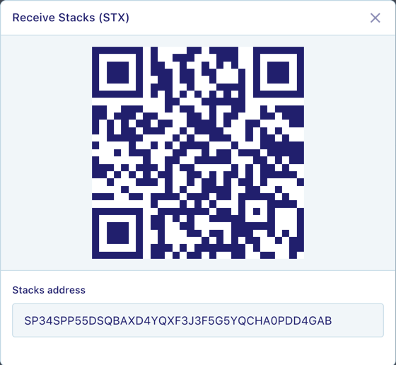
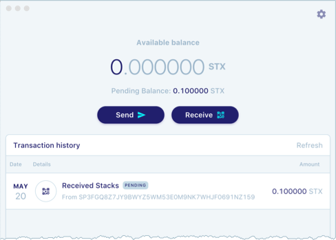
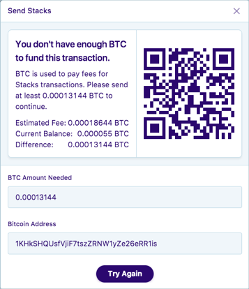
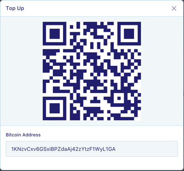
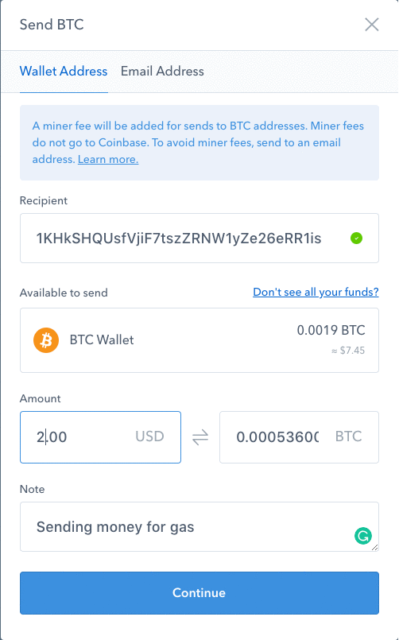
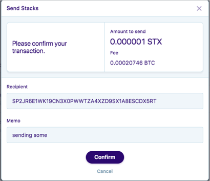

# Use the Stacks Wallet software
{:.no_toc}

This page describes how to use the Stacks Wallet software to manager your Stacks (STX) tokens. This page contains the following topics:

* TOC
{:toc}

The Stacks Wallet software is installed on your computer, it is not a web application. You should have already [downloaded, verified, and installed the wallet software](wallet-install.html).

## Key concepts you should understand

 You use Stacks Wallet software to manage STX tokens. Using the wallet you can:

* send STX from a specific STX address
* receive STX at a specific STX address
* view balances on an address
* review transaction history associated with an address

To send STX, you need Bitcoin in your wallet. Bitcoin is the "gas" for transactions on the Stacks blockchain.  A **_very small_** amount of Bitcoin is required to send STX. The gas price fluctuates like any market and is driven by the price of Bitcoin. Gas is not required to receive STX.

You can use the Stacks Wallet software by itself or together with a hardware wallet. Using with a hardware wallet is recommended but not required.

<h5>Investers and large token holdings: Hardware devices </h5>

If you are an investor or current Stacks token holder, you should have your relevant STX addresses on a configured hardware device before using the Stacks Wallet software. If you have very large holdings, we recommend and anticipate these are held with a custodial service. In the case of a custodial service, you would work with your service to transfer a portion of your holdings to an appropriate hardware device before using the Stacks Wallet software.

### A hardware device with the wallet

You can use any of these hardware wallets with the Stacks Wallet:

* Trezor One
* Ledger Nano S
* Ledger Blue

The private key on your hardware wallet is used by the Stacks Wallet software to sign send transactions. Receive transactions don't require a signature. Please consult the device's manufacturer for support in setting up and configuring your hardware device.

### Software only wallet and a seed phrase

You can use the Stacks Wallet software without a hardware device to create one or more software wallets. Each wallet has its own address which corresponds to a STX address on the Stacks blockchain. You access this address with a unique, **seed phrase**. The software generates a seed phrase for you when create a software-only wallet. The seed phrase consists of 24 words in a sequence. Both the word _and its position the sequence_  are important.  

Write down your seed phrase and store it in a secure location such as a safe deposit box. When you write the seed phrase down, include its position, for example,`1-frog, 2-horse, 3-building` and so on until you reach a final position `24-ocean`.



### About the reset function

The **Reset** function is always available regardless of whether you are using a hardware wallet or a software-only. A **Reset** returns a wallet to its original state. It does not change your STX balance, your Stacks addresses, or any connected hardware wallet in any way.

### Used an older version of the wallet?

If you used the original, v1, version of the wallet, you should instead begin using the new Stacks Wallet v3. you should have a 24 word seed phrase from that wallet. You can use this same seed phrase to open this new version of the Stacks Wallet Software.

The v2 version of the wallet required a hardware wallet to send and receive. You can connect this same hardware wallet to the v3 version of the Stacks Wallet software. If this is your situation, choose **Use existing wallet** when you first start the Stacks Wallet v3; you don't need to create a new wallet.

## Create a new or open an existing wallet

When you start the Stacks Wallet it prompts you to create a new or choose an existing wallet. You should create a new wallet if you have not previously connected a hardware device to the Stacks Wallet v3 software or if you do not have an existing 24 word seed phrase.

### Use with a hardware wallet

Initialize and configure your wallet according to the manufacturer's instructions before you use it with the Stacks Wallet software. Some hardware wallets require that you have additional software installed to support the hardware wallets interactions with the Stacks Wallet.

<table class="uk-table uk-table-small uk-table-divider">
    <tr>
      <th>Hardware wallet</th>
      <th>Prerequisite software</th>
    </tr>
    <tr>
      <td>Trezor One</td>
      <td><a href="https://doc.satoshilabs.com/trezor-user/download.html" target="\_blank">Trezor Bridge</a></td>
    </tr>
    <tr>
      <td>Ledger Nano S</td>
      <td>None.</td>
    </tr>
    <tr>
      <td>Ledger Blue</td>
      <td>None.</td>
    </tr>
</table>

Make sure you have installed any prerequisite software. It is a good idea to connect your hardware wallet to your computer before starting the Stacks Wallet software, but it is not required. 

When your hardware device is ready, do the following:

1. Connect your hardware wallet to your computer as you normally would.
2. Double-click on the wallet software to open it.
3. Select **Create new wallet** or **Use existing wallet**.

   If you connected your hardware device to an old version of the Stacks Wallet software, you choose **Create new wallet**. After you make this initial connection, the *next time* you start the wallet, you can choose **Use existing wallet**.

   The system asks if you have a hardware wallet.

4. Choose **Yes, I do**.

   The system prompts you to select a hardware wallet.

5. Select the hardware wallet you want to use.

   This example uses a Trezor wallet.

   

   The system prompts you to connect your
   device.

6. Connect your wallet to your computer and choose **Continue**.

   The system prompts you to export a public key.

   

7. Select **Export**.

   The Stacks Wallet shows the current wallet balance.

### Software only wallet

If you have an existing 24 word seed phrase from this or a previous version of the Stacks Wallet software, you don't need to create a new wallet, you can **Use existing wallet**. This procedure assumes you are creating a wallet for the first time.

1. Double-click on the wallet software to open it.
2. Select **Create new wallet**.

   The system asks if you have a hardware wallet.

3. Choose **No, I don't**.

   The system prompts cautions you that a hardware wallet is recommended. 

4. Choose **Continue without a hardware wallet**.

    The system generates a seed phrase for you and prompts you to write it down.
    Don't lose your seed phrase. If you lose your seed phrase, you lose your STX tokens and can never get them back. 

5. Write down each word and its position, for example,` 1 - frog`. 
6. Store your written seed phrase in a secure location such as a safe deposit box.
7. Click **I've written down my seed phrase**.

    The system prompts you to re-enter your seed phrase. The sequence numbers are out of order. For example, `5` may appear in the `1` position. Enter the corresponding `5` and `1` word as appropriate.

8. Select **Done**.

   The system displays the balance for the address that corresponds to your seed phrase.

## View balance, allocation, or transaction history

The default view for an open and loaded wallet is the **Wallet Balance** view.

Notice this view includes **Send** and **Receive** buttons. 

Both balances show **Transaction History** if it exists for an address. A
transaction summary appears on the initial screen. To see details,
click on a transaction:

Not all addresses have a balance. If you are a Stacks token holder, your
address shows with both a **Balance** and **Allocation**. The **Balance** is the
Stacks you have unlocked. The **Allocation** is the amount still locked up.

## Receive Stacks

To receive Stacks: you give a STX address directly to a user via email or text, for
example. 

1. Click the **Receive** button to display the wallet address. where others can send STX to.

   

2. Email or text the address to the person or organization sending to you.

    A Stacks address is a public addresses. Anyone with the address, can view the address balance or send money _**to**_ the address.

3. Look for the receipt transaction in your transaction history.

   Once the person has sent you STX, you see a **PENDING** transaction which means the transaction is still being recorded by the blockchain.

      

   Blockchain transactions take time. It may be minutes or hours before the transaction is recorded in the blockchain. When the transaction is complete, you can see a receipt for the transaction in your Stacks Wallet. The **PENDING** marker goes away once the funds are recorded on the blockchain.

## Add Bitcoin gas

The Stacks Wallet uses very small amounts of Bitcoin to pay fees for sending transactions. You need very small fractions of Bitcoin (BTC) for gas. The cost of gas you need fluctuates with the market price of Bitcoin.



You can only receive Bitcoin with Stacks Wallet; you cannot send Bitcoin. You need an account with Coinbase or similar exchange to buy Bitcoin and send it to the Stacks Wallet.

If you attempt to send STX with your wallet and you do not have enough Bitcoin to fuel the transaction, you see this dialog:

 To increase your Bitcoin for transactions, do the following:

 1. Click the 
  (settings icon) in the upper right corner of the wallet.

    The system opens the **Settings** dialog.

    

    This dialog shows you how much BTC you currently have in your account.

2. Select **Add BTC**.

   The systems displays the **Top Up** dialog with a Bitcoin address.

   

3. Record the BTC address.
4. Go to your Coinbase or similar account.
5. Send Bitcoin to the address presented by the Stacks Wallet.

   

Review your Stacks Wallet settings to see the increase in your balance. Your BTC balance only appears in this area.

## Send stacks

Sending stacks is a transaction you must authorize or sign. If you have connected your Stacks Wallet to a hardware wallet. The Stacks Wallet software uses the hardware wallet to sign your send transactions. A software-only wallet asks you for the 24-word key phase you used to create the wallet.

1. Open the Stacks Wallet.

   If you are starting after a reset, choose **Use a Hardware Wallet**.

2. Connect your hardware wallet to your computer.
3. Select **Send**.

   The system displays the **Send** dialog.

4. Complete the dialog with the transaction information.

    | **Recipient**      	| A Stacks address.	|
    | **Amount to Send** 	| Enter a value.   	|
    | **Note**   	        | A memo for the transaction.  	|

5. Select **Continue**.

    If you do not have enough Bitcoin to fuel the transaction, the system
    notifies you. If you don't have enough Bitcoin, you must **Top Up**.
    Otherwise, the system prompts you to connect to your hardware wallet. Your
    hardware wallet will prompt you for additional information and actions.

    

6. Select **Continue**.

   The Stacks Wallet displays a confirmation dialog.

   

7. Select **Confirm** to complete your transaction.

   

8. Select **Close**.

   The send transaction appears in your **Transaction History**. Blockchain
   transactions can take minutes or hours to complete.

   Select **Refresh** if you don't immediately see the transaction in your
   history.

## Reset the wallet

Resetting a wallet clears all your data from the Stacks Wallet and returns the
wallet to its original state.

* If you entered a Stacks address, resetting clears the address from the Stacks Wallet.
* If you connected to a hardware wallet, resetting removes the connection to the hardware wallet.

Resetting the wallet does nothing to your addresses or their associated balances.
They are maintained.

Once you reset the wallet, you have to start over from the *Terms of Use*. If
you do not restart the wallet, you can simple close it.

1. Click the 
 (settings icon) in the upper right corner of the wallet.

   The system opens the **Settings** dialog.

   

2. Select **Reset Wallet**.

   System asks for confirmation. If, for some reason, you want to stop the reset
   you would press  (right corner) or **Close**.

3. Select **Are you sure?** to complete the reset.

   The wallet displays the **Terms of Use**. You can accept to enter the wallet
   again or choose **Quit**.
